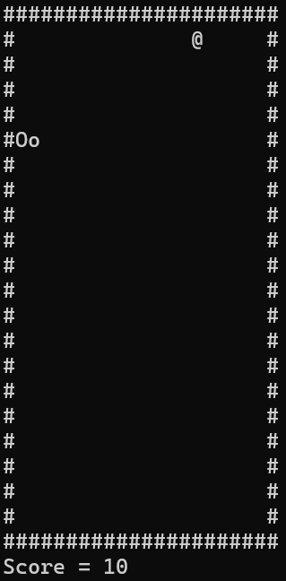
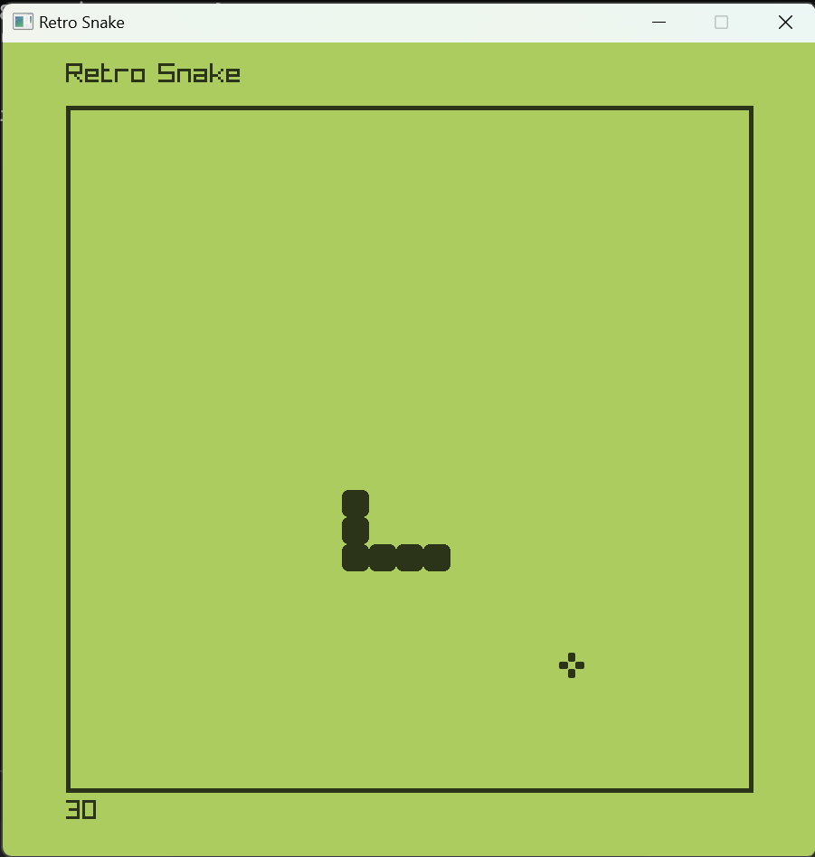

# Retro Snake Game in C++
This is a fun C++ project that i always wanted to work on. The retro snake game.  I am a big fan of video games and this game is one such game that is nostalgic, I used to play it on my dad's nokia and loved it. 

1. snake_console_cpp/retro_snake.cpp - This is a single C++ file console snake game which implements this game on a skeletal level. A basic fun snake console game.
 

2. snake_raylib_cpp - This is a Visual Studio project in C++ with the Raylib library. The game is implemented in a relatively better way in terms of the design as well as Object Oriented Programming was used.
 
